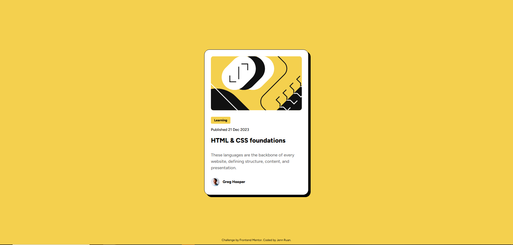

# Frontend Mentor - Blog preview card solution

This is my solution for the [Blog preview card challenge on Frontend Mentor](https://www.frontendmentor.io/challenges/blog-preview-card-ckPaj01IcS).

## Table of contents

- [Overview](#overview)
  - [Screenshot](#screenshot)
  - [Links](#links)
- [My process](#my-process)
  - [Built with](#built-with)
  - [What I learned](#what-i-learned)
  - [Continued development](#continued-development)
  - [Useful resources](#useful-resources)
- [Author](#author)
- [Acknowledgments](#acknowledgments)

**Note: Delete this note and update the table of contents based on what sections you keep.**

## Overview

### Screenshot



### Links

- Live Site URL: [Add live site URL here](https://your-live-site-url.com)

## My process

### Built with

- Semantic HTML5 markup
- CSS custom properties
- Flexbox

### What I learned

I learned how to make text presets to reuse across multiple components, and how to make their sizes responsive at different screen sizes.

```css
.text-preset-1 {
  font-weight: 800;
  font-size: clamp(20px, 5vw, 24px);
  line-height: 1.2;
}
```

I also learned a lot about flexbox. It's harder than I thought to get something in the dead center of a screen.

```css
main {
  box-sizing: border-box;
  display: flex;
  justify-content: center;
  align-items: center;
  width: 100%;
  flex-grow: 1;
}
```

### Continued development

Need to keep working on responsive and accessible designs!

### Useful resources

- [clamp()](https://developer.mozilla.org/en-US/docs/Web/CSS/Reference/Values/clamp) - This helped me learn how to resize fonts at different screen sizes!

## Author

- Website - [Jenn Ruan](https://github.com/jennifer-ruan)
- Frontend Mentor - [@jennifer-ruan](https://www.frontendmentor.io/profile/jennifer-ruan)
